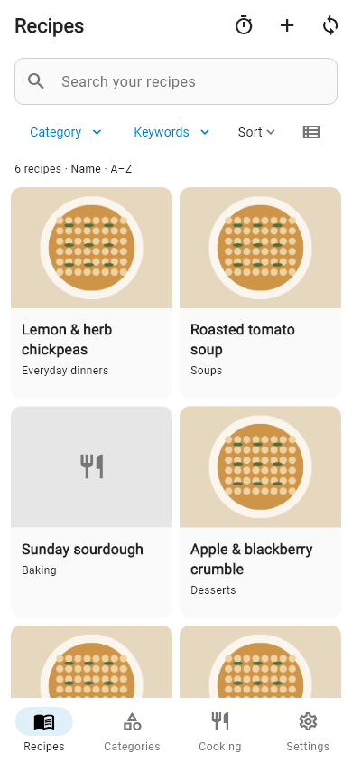
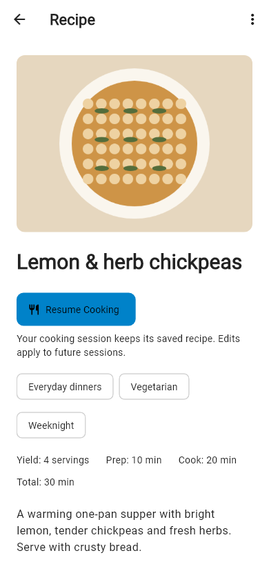
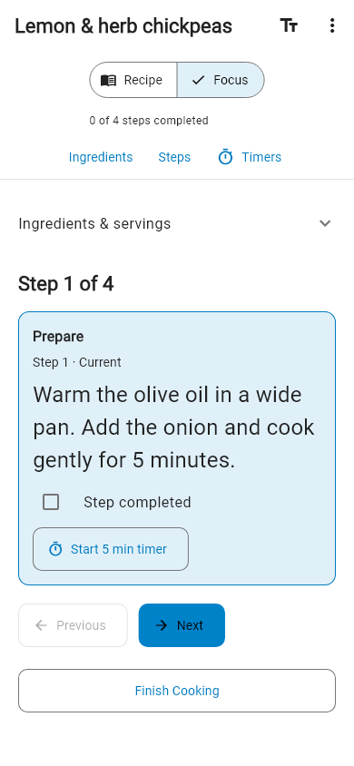

# Cookbook

Cookbook is an unofficial open-source Android client for Nextcloud Cookbook, built with Flutter. It connects directly to your own Nextcloud server for native recipe management, offline access, synchronization, and a kitchen-focused Cooking Mode.

## Your recipes, on your server

- Browse recipes in List or Grid, with search, categories and keyword filters.
- Create, edit, delete and import recipes; choose images from Nextcloud Files.
- Read downloaded recipes offline and queue edits for synchronization. Review conflicts and uncertain uploads before retrying.
- Cook with Recipe or Focus view, persistent progress, serving adjustment and optional timer notifications.
- Use your Nextcloud instance's colors with system, light or dark appearance.

## Screenshots

<p>
  
  
  
</p>

Synthetic recipes and illustrative artwork; no private account data.

## Install and connect

Requires Android **7.0 (API 24)** or later and an HTTPS Nextcloud server with the **Cookbook app installed and enabled for your account**. See [compatibility](docs/compatibility.md).

Download `cookbook-1.0.0.apk` from this repository's GitHub Releases, compare its SHA-256 with `SHA256SUMS.txt`, and open it on Android. Allow installation from your chosen browser/file manager when Android asks. Use the universal APK for predictable updates; keep the same signing identity across releases.

Enter your Nextcloud URL, including any installation subdirectory. Cookbook opens your external browser for Nextcloud Login Flow v2. Approval creates an app password; Cookbook does not receive your normal account password. Advanced sign-in accepts a dedicated Nextcloud app password.

Downloaded recipe text remains available offline; images must already be cached. Editing and importing queue locally until synchronization can reach the server. A queued import needs the server before its recipe can be read. Conflicts require review, and uncertain mutations are not blindly replayed. Avoid simultaneous edits from multiple clients: the server API does not provide atomic conditional writes.

## Cooking

Recipe view keeps ingredients and steps together; Focus shows the current step. Completion advances to the next incomplete step without finishing the session. Serving adjustments, progress and timers are local. Recipe Detail ingredient checks are separate preparation state. See [Cooking Mode](docs/cooking-mode.md) for timer behavior and limits.

## Privacy and scope

No advertising, analytics SDK or project-owned backend. Credentials use Android secure storage; offline recipe data stays on the device. The server and websites you explicitly open have their own privacy policies. Read [PRIVACY.md](PRIVACY.md).

Cookbook aims to be a native client for existing Nextcloud Cookbook functionality. Shopping-list management, meal planning, AI recipe generation, OCR services and project-owned cloud services are outside its scope unless upstream Cookbook changes.

## Build and contribute

Use **Flutter 3.44.6 / Dart 3.12.2**, JDK 21 and the Android SDK:

```sh
flutter pub get --enforce-lockfile
flutter test
flutter build apk --debug
```

See [building](docs/building.md), [contributing](CONTRIBUTING.md), [architecture](docs/architecture.md), and [local production releases](docs/releasing.md). Release builds require your own locally configured signing identity.

## License and affiliation

[MIT](LICENSE); dependencies retain their own licenses and [notices](THIRD_PARTY_NOTICES.md). Cookbook is not affiliated with or endorsed by Nextcloud GmbH or the upstream Cookbook maintainers. Nextcloud is a trademark of its respective owner; the launcher artwork is an original cookbook symbol.
